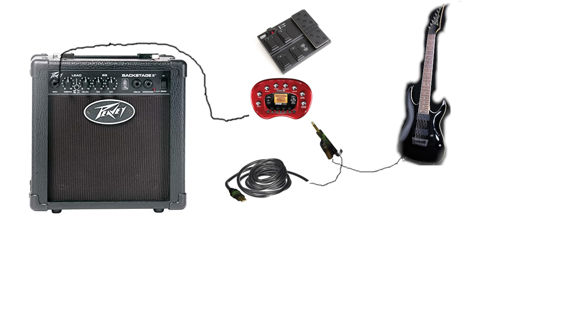

# QTGuitarFX
QTGuitarFX - guitar sound fx pre processor for jack and alsa

https://sourceforge.net/projects/astylredfx/files/ original version looks like its for windows and linux, neat.

teslaenergy@gmail.com any questions or concerns.

compiling
qmake-qt5 .
make

or 

qmake && make

qt creator can be used to open the pro file aswell

hardware in guitarrig photo

a more advanced setup includes this.
mk2 fpv floor pod
line6 podxt - not as good as the audio cables with usb because of the power supply it makes a humm, could possibly be avoided with a usb hub.
light snake audio input cable. the rocksmith xbox360 cable sounds better but does not have the extra playthrough plug.
use 2 cables from amplifier to the line6 pod with a F to F adapter to make life easier testing sound quality on amp.
peavy practice amplifier, wont need this if using computer speakers.
7 string guitar ibanez with (custom switch for power used to eat batteries if left on).
